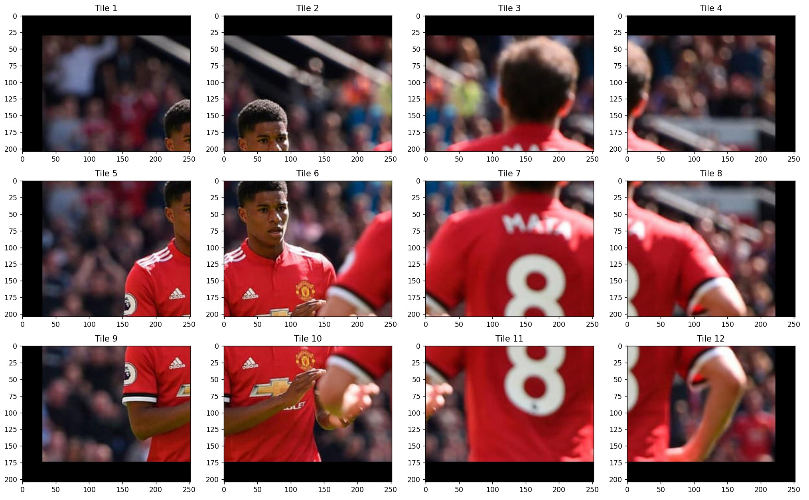
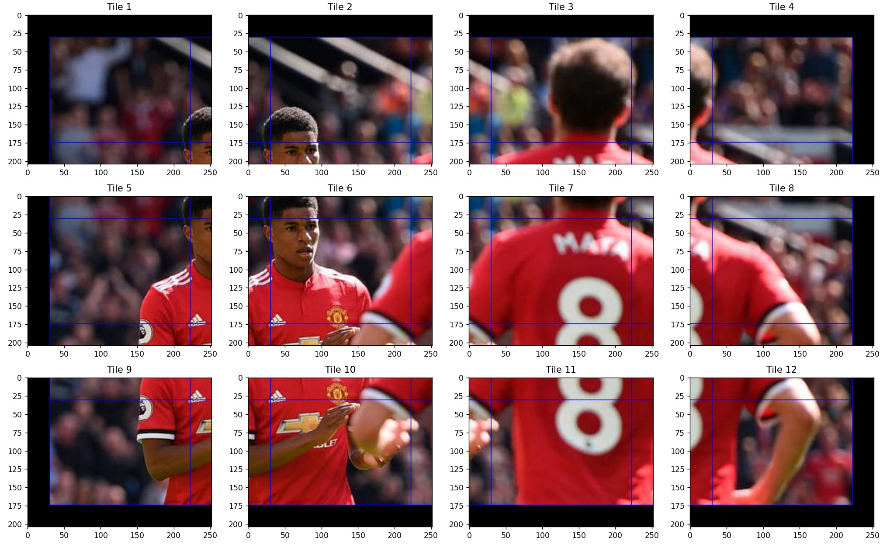
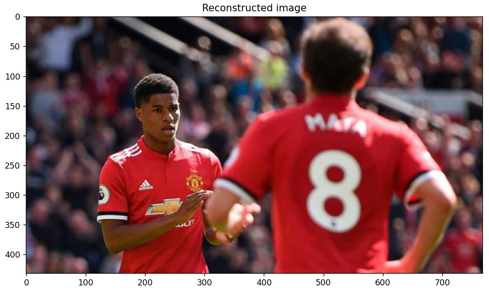
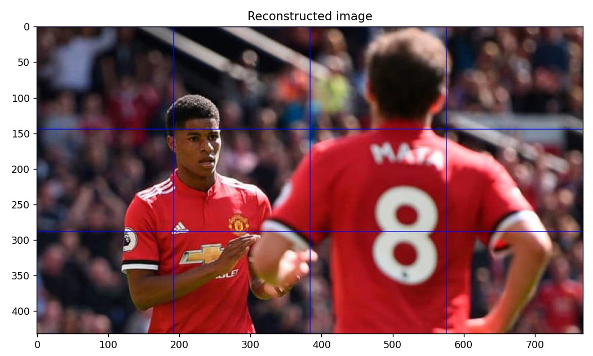

# Image Tiler

Image Tiler is a Python package that allows you to split an image into tiles based on a grid and overlap between tiles. It also provides functionality to combine the tiles back into the original image.

## Installation

You can install Image Tiler using pip:

```shell
pip install ImgTiler
```

## Usage
### SplitImage Class
The `SplitImage` class is used to split an image into tiles based on a grid and overlap between tiles. The class takes in an image path, the number of rows and columns in the grid, and the overlap between tiles.

#### CombineTiles Class
The `CombineTiles` class is used to combine tiles back into the original image. The class takes in a list of tiles, the number of rows and columns in the grid, and the overlap between tiles.

#### Example
```python
from ImgTiler import SplitImage, CombineTiles
import cv2

img = cv2.imread('image.jpg')
grid = (3, 4) #3 rows, 4 columns
overlap = 30 #30 pixels
show_rects = True
show_image = True

splitter = SplitImage(img, grid, overlap) # Create SplitImage object
tiles = splitter.split_image(show_rect=show_rect, show_tiles=show_image) # Split image into tiles

combiner = CombineTiles(tiles, grid, overlap) # Create CombineTiles object
img2 = combiner.combine_tiles(show_image=show_image) # Combine tiles into original image
```
#### Original Image


#### Split Result



#### Combined Image



## Contributing
Pull requests are welcome. For major changes, please open an issue first to discuss what you would like to change.

## License
This project is licensed under the [MIT](https://choosealicense.com/licenses/mit/) license.
